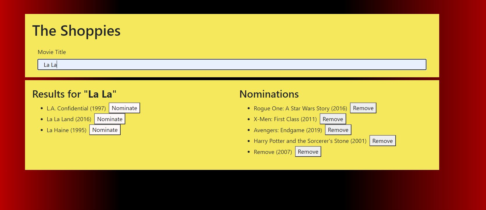
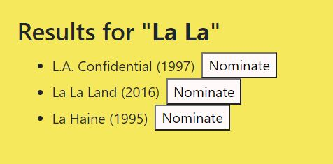
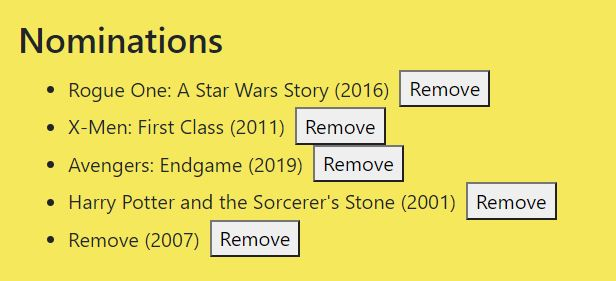

 # The Shoppies Movie Nominations
  
 

  ## Table of Contents
  * [Description](#description)
  * [Installation](#installation)
  * [Usage](#usage)
  * [Contribute](#contribute))
  * [Questions](#questions)
  * [Deployed Link](#deployed)
    
  ## Description
  
 An app that allows you to vote for your top 5 movies ever! 

  
  ## Installation
  
 The app comes fully set up on Github pages 

  ## Usage
  
  
 Users are presented with a search bar upon loading the page for the first time with two blank boxes for search results and nominations. The User can start by typing in the name of any movie they want and the results section with autopopulate the results from the query. 
 
  
  
 Each entry in the results section has a button available to nominate it for the User's top 5 movies. Once clicked the corresponding movie will be added to the nomination section. If the movie is already nominated, the nomination button will be disabled. 
 
  
  
 The User can remove any unwanted nominations by clicking the remove button next to the unwanted nomination. Once the User has chosen 5 movies to nominate, the site will load a banner displaying the User's 5 choices. If the user needs time to watch any movies to update their top 5 then any selections they already made will be saved to local storage. 

  
  ## Contribute
  
 Contact Conor using the infomation below to contribute to the project. 

  ## Questions
  
 For any questions, contact me at 

  <h3> Email : </h3>
  <strong>mckoyc@gmail.com</strong>
    
  <h3> Github Account:</h3>
  
  
  [mckoyc94](https://github.com/mckoyc94)

  ## Deployed
  
  [The Shoppies](https://mckoyc94.github.io/theShoppies/)